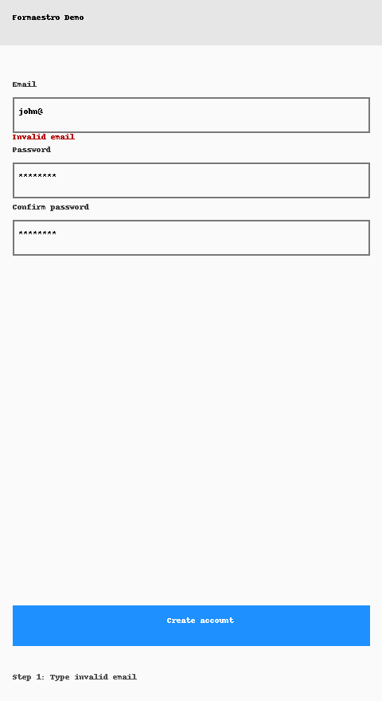

# formaestro

[](https://pub.dev/packages/formaestro)

[](#)
[](https://github.com/MarciohsjOliveira/formaestro/actions/workflows/ci.yml)
[](#)
[](LICENSE)

A **reactive, async-first** form engine for Flutter with **cross-field validation** and a delightful DX.

https://github.com/MarciohsjOliveira/formaestro

## Quickstart

```dart
final schema = FormaestroSchema({
  'email': FieldX<String>(
    validators: [Validators.required(), Validators.email()],
  ),
  'password': FieldX<String>(validators: [Validators.minLen(8)]),
  'confirm': FieldX<String>(),
}, rules: [
  Rule.cross(['password', 'confirm'], (values) {
    return values['password'] == values['confirm'] ? null : 'Passwords mismatch';
  }),
]);

final form = Formaestro(schema, debounce: const Duration(milliseconds: 250));

// Wire to your text fields via controllers:
final email = form.field<String>('email');
// email.controller etc.

final isValid = await form.validateAll();
if (isValid) submit(form.values);
```

## Examples
- Runnable app under `/example`:
  - signup with async validators
  - cross-field rules
  - debounce + cancellation

## Roadmap
- Adapters for `flutter_bloc`, `riverpod`
- i18n message catalogs (en, pt-BR)
- Field arrays and multi-step wizard

## Contributing
See [CONTRIBUTING.md](CONTRIBUTING.md).

## License
MIT


## Install

```yaml
dependencies:
  formaestro: ^0.1.0
```

## Features
- Type-safe fields (`FieldX<T>`)
- Async-first validation (debounce + cancellation-friendly)
- Cross-field rules (`Rule.cross` / `Rule.crossAsync`)
- Composable validators (sync/async)
- Framework-agnostic: works with BLoC / Riverpod / Provider

## Demo (GIF)


## FAQ
**Is it a replacement for `Form`/`TextFormField`?** No. Use them together if you prefer. Formaestro focuses on orchestration & validation.

**How do I perform server validation?** Create an async validator that calls your API (see example).


## Testing
Run `flutter test --coverage`. The suite includes stream reactivity, async validators and cross-field rules.

## Community
Use GitHub Issues with our templates for bugs and features.
